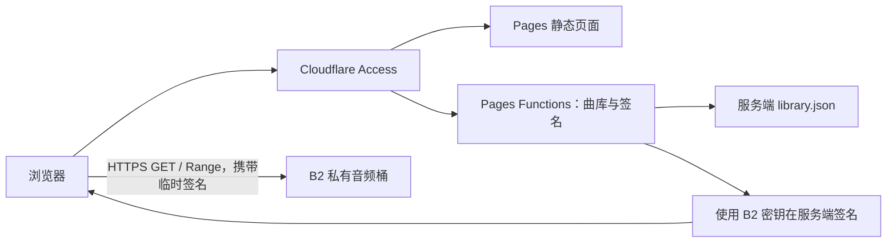

# 云端音乐播放器：设计方案与编码指南

版本：v1.0 · 日期：2026-09-07 · 状态：开发前设计

本文是一个完整的设计交付文件，包含产品、界面、架构、接口、关键实现、部署和适量验收要求。本文不等于已实现或已上线的播放器，也不要求把未来全部代码塞入一个文件。

## 1. 方案结论与默认假设

采用 **Vite + React + TypeScript 前端，部署到 Cloudflare Pages；Pages Functions 提供曲库和临时播放地址；浏览器通过原生 `<audio>` 直接播放 Backblaze B2 中的音频。**

将“B2 OSS”理解为 Backblaze B2 对象存储，使用其 S3 兼容接口，不接入阿里云 OSS。默认这是个人或少量亲友使用的私有曲库，已有或可准备音频文件；首版按约 100～3,000 首设计，这只是实现预算，不是平台限制。

关键取舍：

| 项目 | 首版决定 | 原因 |
| --- | --- | --- |
| 存储 | B2 私有桶 | 音频不公开暴露永久下载链接 |
| 音频传输 | 浏览器直连 B2 | 不编写音频代理和分片转发逻辑 |
| 后端 | 同一 Pages 项目的 Functions | 只需要两个业务接口 |
| 曲库 | 服务端打包一份 JSON 清单 | 不需要数据库或在线扫描任务 |
| 访问权限 | Cloudflare Access 邮箱白名单 | 不自建密码、用户表和登录系统 |
| 播放 | 单个原生 HTMLAudioElement | 保留浏览器的缓冲、解码和 Range 能力 |
| 偏好 | localStorage | 收藏、音量、上次进度仅在本机保存 |
| 样式 | 普通 CSS + 少量组件 | 不引入大型 UI 套件 |

B2 支持下载预签名 URL；Pages Functions 支持在 Workers 运行时执行服务端逻辑，因此这个组合能够承载所需的轻量接口。[B2 S3 兼容接口](https://www.backblaze.com/docs/cloud-storage-s3-compatible-api)、[Pages Functions](https://developers.cloudflare.com/pages/functions/)

若实际希望所有人免登录收听，应明确改为公开服务，再删除 Access 校验并补充滥用与费用控制；不要把“桶是私有的”误认为“签名接口可以公开”。

## 2. 首版范围

### 必须实现

- 曲库列表：歌曲名、歌手、专辑、时长；没有标签时显示文件名和“未知歌手”。
- 本地搜索：按歌曲、歌手和专辑匹配，空搜索显示全部歌曲。
- 播放、暂停、上一首、下一首、进度拖动和桌面音量。
- 顺序播放、随机播放、单曲循环；明确显示当前模式。
- 当前播放队列：点击歌曲时，以当前筛选结果的顺序生成队列快照。
- 本机收藏；“全部音乐 / 我的收藏”两个筛选入口。
- 记住最近播放歌曲、播放位置、模式和音量；重新打开后等待点击，不自行发声。
- 桌面与手机布局；曲库加载、空库、加载失败、播放失败的明确反馈。
- 私有桶签名与 Access 权限校验。

### 明确暂缓

不做在线播放上传管理、云端收藏同步、多用户权限表、分享链接、歌词抓取、AI 推荐、均衡器、波形、无缝衔接、跨淡入淡出、HLS、自建转码、离线下载和 PWA 缓存。

曲库增加歌曲的首版路径是：上传 B2 → 更新 JSON 清单 → 重新部署。若维护量变大，再增加本地清单生成脚本；不要先建设后台管理系统。

## 3. 页面与视觉设计

### 3.1 风格

名称暂用“云端音乐”。以深色、清晰的音乐列表为主，播放器始终可见，不放宣传横幅、统计卡片或与收听无关的导航。

| 设计项 | 建议值 |
| --- | --- |
| 页面底色 | `#101216` |
| 列表与播放器底色 | `#191D24` |
| 悬停/选中底色 | `#242B35` |
| 主文字 | `#F4F6FA` |
| 次级文字 | `#A8B1C0` |
| 强调色 | `#5DD6C0`，用于播放键、进度和当前曲目 |
| 分隔线 | `#303845` |
| 字体 | 系统字体，中文使用系统中文无衬线回退 |
| 字号 | 正文 16px，辅助信息 14px，标题 24px |
| 间距 | 8 / 12 / 16 / 24 / 32px |
| 圆角 | 面板 12px，按钮 8px |

专辑封面不是首版必需数据。统一使用文字缩略图或简单音乐图标占位；不为每首歌预读音频里的嵌入封面。将来有现成小尺寸封面时再接入。

### 3.2 桌面布局（宽度 ≥ 900px）

```text
┌─────────────────────────────────────────────────────────────┐
│ 云端音乐          [ 搜索歌曲、歌手、专辑              ]      │
├───────────────┬─────────────────────────────────────────────┤
│ 全部音乐      │ 全部音乐                  128 首             │
│ 我的收藏      │ 歌曲                  歌手     专辑     时长 │
│               │ ▶ 夜航                林间     远方     3:42 │
│               │   海风                林间     远方     4:10 │
│               │   ……                                        │
├───────────────┴─────────────────────────────────────────────┤
│ 夜航 · 林间       上一首  [暂停]  下一首      模式  音量 队列 │
│                  0:48 ━━━━━●━━━━━━━━ 3:42                   │
└─────────────────────────────────────────────────────────────┘
```

左栏约 180px；内容最大宽度约 1,440px；歌曲行高约 60px；底部播放器约 96px。队列通过侧抽屉展开，不常驻第三栏。以上歌曲仅为界面示意，不作为真实曲库。

### 3.3 手机布局（宽度 < 900px）

- 顶部名称、搜索框和两个筛选标签；隐藏左侧栏。
- 歌曲行只显示“歌曲名 / 歌手”和收藏按钮，专辑列收起。
- 底部固定迷你播放器：歌曲信息、播放/暂停、下一首、细进度条。
- 点击歌曲信息打开完整播放器，包含进度、模式和队列；完整播放器是同一音频实例的控制界面。
- 底部加入 `env(safe-area-inset-bottom)`；列表底部留出播放器高度，最后一首不能被遮住。
- 按钮触摸区域至少 44×44px；手机优先使用系统音量，不能保证网页音量滑块在所有设备有效。

### 3.4 交互细节

- 行内提供真实 `<button>` 播放按钮；收藏按钮独立，不触发整行播放。
- 搜索变化不重建已在播放的队列，也不打断当前歌曲；再次点击结果歌曲才建立新队列。
- 播放当前歌曲表示播放/暂停；上一首在已播放超过 3 秒时回到开头，否则切上一首。
- 顺序模式播到末尾停止；随机模式从剩余未播放歌曲抽取，播完一轮停止；上一首使用历史栈。
- 单曲循环只影响自然结束事件，手动下一首仍能切歌。只有一首时随机结束停止。
- 拖动进度时显示预览时间；释放后再写入 `audio.currentTime`，避免每一像素触发网络请求。
- 时长未知显示 `--:--`，不显示 `NaN`；不能 seek 时禁用进度操作。
- 键盘可聚焦所有控件；Space 播放/暂停快捷键不作用于输入框和正在使用的原生按钮，避免重复触发。
- 加载曲库失败提供“重试”；搜索无结果提示“没有找到匹配歌曲”；曲库为空提示“曲库还没有歌曲”。

## 4. 系统结构与数据流



Functions 签名时只进行本地密码学运算，不需要每次向 B2 请求授权；签名成功不代表对象存在，对象读取结果由 B2 返回。

一次播放的步骤：

1. 用户通过 Access 邮箱验证，浏览器加载页面。
2. 页面请求同源 `GET /api/library`，取得可展示的曲目。
3. 用户点击曲目，客户端请求 `GET /api/play-url?id=trk_0001`。
4. Function 验证 Access JWT、查清单，把对应 B2 对象签为短期 GET URL。
5. 浏览器设置唯一 audio 实例的 `src` 并调用 `play()`。
6. B2 向浏览器发送音频字节；浏览器负责缓冲和解码。
7. 用户拖动进度时，浏览器按需要发起 Range 请求。

**边界：页面经 Cloudflare 分发，音频仍从 B2 直达用户。** 不能据此宣称音频经过 Cloudflare CDN、全球加速或享有合作伙伴免费出站。若以后实测直连表现不佳，再单独评估音频代理、费用与缓存规则，不在首版混入第二条播放链路。

## 5. B2 文件与曲库设计

### 5.1 存储约定

建议路径：

```text
music/
  artist-a/album-a/01-night-flight.mp3
  artist-a/album-a/02-sea-breeze.mp3
```

已有中文文件名可以保留，不要求迁移。对象 key 必须保留原文，构造 URL 时按路径段编码；不能把 key 中的 `/` 全部编码成一个文件名，也不能把 `#` 或 `?` 当作 URL 语法。

新文件尽量避免 `.`、`..` 独立路径段和反斜杠。清单校验遇到这些名称要报错，因为 URL 实现可能归一化路径，造成签名对象与预期不一致。

首版以 MP3 为兼容性基线，上传时使用 `Content-Type: audio/mpeg`。M4A/AAC、FLAC、Ogg/Opus 等文件可保留，但能否播放取决于实际编码、容器与浏览器；不能只看后缀就承诺支持。不在 Pages 上转码；确有不兼容文件时在本地离线转换后上传。

通过 `canPlayType()` 作提示，实际 `play()` 和媒体事件为最终依据。原生 audio 暴露播放时间、缓冲和状态信息。[HTMLMediaElement](https://developer.mozilla.org/en-US/docs/Web/API/HTMLMediaElement)

### 5.2 清单模型

`server/library.json` 随 Functions 打包，**不能放在 `public/`，也不能被前端模块 import**。

```json
{
  "schemaVersion": 1,
  "updatedAt": "2026-09-07T00:00:00Z",
  "tracks": [
    {
      "id": "trk_0001",
      "title": "夜航",
      "artist": "林间",
      "album": "远方",
      "duration": 222,
      "mimeType": "audio/mpeg",
      "objectKey": "music/artist-a/album-a/01-night-flight.mp3"
    }
  ]
}
```

规则：`id` 全库唯一且长期稳定；`title`、`objectKey` 必填；`artist`、`album` 缺失时前端显示占位；`duration` 可为 null，有值时必须为正的有限秒数。真实播放后以 `audio.duration` 为准。删除歌曲时从清单移除，并在客户端清理无效收藏和上次播放记录。

清单只包含要开放播放的对象。后端按 id 查 key，不允许客户端直接提交 key、bucket、host 或任意远程 URL。

不在网页启动时 ListObjects，不为整库签名，也不为每首曲目拉取媒体元信息。运行时 B2 密钥只需限制在目标桶/目录的读文件能力；上传与批量整理使用独立管理凭据。

### 5.3 前端类型

```ts
export interface Track {
  id: string;
  title: string;
  artist: string;
  album: string;
  duration: number | null;
  mimeType: string;
}

export interface PlayTicket {
  trackId: string;
  url: string;
  expiresAt: number; // Unix 毫秒；有效期判断使用服务端返回值
}
```

API 返回明确挑选后的字段，不用对象展开顺便带出 `objectKey`。浏览器直连 B2 时，预签名 URL 必然包含访问所需的桶名、object path、key ID（通常在 `X-Amz-Credential` 中）和短期签名/过期参数；`B2_APPLICATION_KEY` 只在 Pages Function 服务端用于签名，绝不发送给客户端。Cloudflare Pages Secret 保护的是部署端保存的值，不会隐藏浏览器网络面板中的请求地址、B2 endpoint 或对象路径。

## 6. 接口与访问权限

### 6.1 只建立两个业务接口

| 接口 | 输入 | 成功响应 | 缓存 |
| --- | --- | --- | --- |
| `GET /api/library` | 无 | `{ schemaVersion, updatedAt, tracks: Track[] }` | `private, no-store` |
| `GET /api/play-url?id=...` | 一个合法曲目 id | `PlayTicket` | `private, no-store` |

错误统一为 `{ "error": { "code": "TRACK_NOT_FOUND", "message": "歌曲不存在或已移除" } }`。

状态约定：400 为缺失/非法 id，401 为缺失或无效身份，404 为清单没有此歌曲，405 为不支持的方法，500 为配置或签名内部错误。签名接口不访问 B2，因此不把“签名成功”包装成“B2 文件存在”；B2 的 403/404 出现在媒体请求阶段。

前端 API helper 检查 `response.ok` 与 JSON Content-Type。Access 会在会话过期时拦截请求或返回登录相关响应，不能把 HTML 直接当 JSON 解析；出现这种情况保留播放位置并显示“登录已过期，请重新进入”。

### 6.2 Cloudflare Access

默认保护整站，只允许指定邮箱；使用托管登录，不开发注册/密码界面。Function 中间件再校验 `Cf-Access-Jwt-Assertion` 的签名、issuer、audience 和有效期，使用 `jose`，不能仅判断 header 存在或信任邮箱 header。[Access JWT 校验](https://developers.cloudflare.com/cloudflare-one/access-controls/applications/http-apps/authorization-cookie/validating-json/)

配置 `ACCESS_TEAM_DOMAIN` 与 `ACCESS_AUD`；JWKS 从固定团队域名的 `/cdn-cgi/access/certs` 获取，复用远程 JWK 缓存实例。校验配置缺失时拒绝请求，不降级为公开访问。

保护范围应同时检查正式自定义域名、生产 `project.pages.dev` 和预览域名。Pages 的“Enable access policy”默认只保护预览，不自动保护正式域名。[预览部署权限说明](https://developers.cloudflare.com/pages/configuration/preview-deployments/)

首版不为预览环境配置生产 B2 密钥；预览使用示例曲库或独立测试桶。这样不必立即处理多个 Access AUD 的组合。

### 6.3 必要的凭据边界

- B2 bucket、key ID 与 application key 全部放 Pages Functions secrets；`B2_ENDPOINT`、`B2_REGION`、`ACCESS_TEAM_DOMAIN`、`ACCESS_AUD` 作为普通变量；不得使用 `VITE_` 前缀。
- 签名地址是有效期内的持有者凭据，知道地址的人可以读取对应文件；Access 保护的是签发入口，不能使已签发地址即时失效。
- API 不记录完整签名 URL、Cookie 或 Access JWT；错误日志只写错误代码和曲目 id。
- 前端不把签名 URL 写入 localStorage，不加入 URL 地址栏，不接第三方分析脚本。
- 页面设置 `Referrer-Policy: no-referrer`；CORS 用于浏览器跨域许可，不能代替身份鉴权。

## 7. 签名与跨域配置

### 7.1 服务端签名

使用 `aws4fetch`，其 `sign()` 支持在查询字符串中生成 AWS V4 签名，并可运行于支持 fetch/Web Crypto 的环境。[aws4fetch 项目说明](https://github.com/mhart/aws4fetch)

下面是后续实现的核心参考，不是已完成的生产接口；调用前必须完成鉴权、清单查找和配置校验：

```ts
import { AwsClient } from 'aws4fetch';

interface B2Env {
  B2_ENDPOINT: string;
  B2_REGION: string;
  B2_BUCKET: string;
  B2_KEY_ID: string;
  B2_APPLICATION_KEY: string;
}

export async function signTrack(env: B2Env, objectKey: string) {
  const endpoint = new URL(env.B2_ENDPOINT);
  // 部署配置校验还应核实 region 与 endpoint 匹配。
  if (endpoint.protocol !== 'https:' ||
      !/^s3\.[a-z0-9-]+\.backblazeb2\.com$/.test(endpoint.hostname) ||
      endpoint.username || endpoint.password || endpoint.port ||
      endpoint.pathname !== '/' || endpoint.search || endpoint.hash) {
    throw new Error('INVALID_B2_ENDPOINT');
  }
  const parts = objectKey.split('/');
  if (!objectKey.startsWith('music/') || objectKey.includes('\\') ||
      parts.some(p => p === '.' || p === '..' || p === '')) {
    throw new Error('INVALID_OBJECT_KEY');
  }
  const encoded = parts.map(encodeURIComponent).join('/');
  const url = new URL(`/${encodeURIComponent(env.B2_BUCKET)}/${encoded}`, endpoint);
  const ttlSeconds = 3600;
  url.searchParams.set('X-Amz-Expires', String(ttlSeconds));
  const issuedAt = Date.now();
  const client = new AwsClient({
    accessKeyId: env.B2_KEY_ID,
    secretAccessKey: env.B2_APPLICATION_KEY,
    service: 's3',
    region: env.B2_REGION,
  });
  const signed = await client.sign(url.toString(), {
    method: 'GET',
    aws: { signQuery: true },
  });
  return { url: signed.url, expiresAt: issuedAt + ttlSeconds * 1000 };
}
```

有效期 1 小时是本方案选择，并非 B2 的强制值。不要将 `Range` 固定到签名中，让浏览器为同一 URL 请求不同区间。签名完成后不能再修改 host、路径或查询参数；也不能把 GET 签名拿去执行 HEAD 检查。

### 7.2 B2 CORS

以下是 **S3 PutBucketCors/AWS CLI 格式**，不是 B2 Native API 的 `corsRules` 格式：

```json
{
  "CORSRules": [
    {
      "AllowedOrigins": ["https://music.example.com"],
      "AllowedMethods": ["GET", "HEAD"],
      "AllowedHeaders": ["Range"],
      "ExposeHeaders": ["Accept-Ranges", "Content-Range", "Content-Length", "ETag"],
      "MaxAgeSeconds": 3600
    }
  ]
}
```

将域名替换为实际生产来源；需要本地真机联调时临时加入准确来源，例如 `http://localhost:8788`，不能忘记端口。不要放开全部 `*.pages.dev`。浏览器的 OPTIONS 预检由 B2 CORS 机制处理，AllowedMethods 不需要加入 OPTIONS。

在准备好独立管理用 AWS CLI profile 后，可将上方 JSON 保存为 `b2-cors.json`，执行：

```powershell
aws --profile b2-admin --endpoint-url https://s3.YOUR-REGION.backblazeb2.com s3api put-bucket-cors --bucket YOUR-BUCKET --cors-configuration file://b2-cors.json
```

该命令会更新桶的 S3 CORS 配置，实施时先读取现有规则并合并其他应用仍使用的来源；本指南没有执行该操作。S3 与 Native API 管理的规则存在差异，统一通过同一种方式维护。[B2 CORS 规则](https://www.backblaze.com/docs/cloud-storage-cross-origin-resource-sharing-rules)

播放器在设置 src **之前** 设置 `audio.crossOrigin = 'anonymous'`，采用查询字符串签名，不向 B2 传应用 Cookie。HEAD 许可仅供独立诊断，不要求播放前额外 HEAD。

### 7.3 Range 与流式播放

直接把 URL 赋给 audio；不要先 `fetch()` 整首音乐生成 Blob，不自写分片下载器。B2 Get Object 提供对象读取与字节范围相关响应信息。[B2 Get Object](https://www.backblaze.com/apidocs/s3-get-object)

联调时查看实际媒体 GET：普通读取可能为 200；显式有效 Range 请求应返回 206 和正确 Content-Range。不能把任何 200 都视为故障，也不能仅因为播放成功就认定拖动可用。

## 8. 播放核心实现指南

### 8.1 只创建一个 audio 实例

在应用根部的 `usePlayer` 中创建 audio，用 React Context 给列表和底栏提供控制方法。audio 不放在每首歌曲行里，也不因手机弹层开关重新创建。

React 开发模式可能重复执行 effect；创建、订阅和清理必须对称，清理时移除事件、取消请求并释放实例，避免双重播放。UI 以真实媒体事件更新，不能在点击按钮时就假定播放已经成功。

建议状态：

```ts
type PlaybackStatus =
  | 'idle' | 'loading' | 'playing' | 'paused' | 'buffering' | 'error';
type PlaybackMode = 'sequence' | 'shuffle' | 'repeat-one';
```

保存 `currentTrackId`、队列 id 列表、历史栈、状态、currentTime、duration、音量、模式和错误信息即可。audio 自身管理媒体缓冲，不在 React state 里复制音频数据。

### 8.2 事件与行为

| 事件/结果 | 处理 |
| --- | --- |
| `loadedmetadata` | 更新有效时长；在恢复流程中设置保存位置 |
| `playing` | 设为 playing，清除等待提示 |
| `pause` | 非切歌内部操作时设为 paused |
| `waiting` / `stalled` | 根据播放意图显示缓冲，不马上刷新 URL |
| `timeupdate` | 更新进度；间隔保存，不每次写磁盘 |
| `ended` | 按当前模式决定下一首或停止 |
| `error` | 检查是否可能过期；有限恢复后给出错误 |
| `play()` 拒绝 | 区分用户手势限制、切歌中断和真实错误 |

浏览器可能拒绝脚本发起的播放，包括先异步取签名再播放的场景。处理 `NotAllowedError` 时保留已加载曲目，提示“点击播放继续”；不能把它当作 B2 故障。快速切歌导致的旧 `AbortError` 通常忽略。[MDN play()](https://developer.mozilla.org/en-US/docs/Web/API/HTMLMediaElement/play)

### 8.3 快速切歌与异步竞争

每次选择曲目递增 `requestId` 并取消上次签名请求。每个 await 后确认 requestId 仍是最新；过期结果直接丢弃，不能覆盖新曲目 src 或新错误提示。

重新赋 src 前暂停旧播放，记录新的播放意图。事件回调与恢复任务同样使用本次标识；一次连续切歌结束后，只有最后选择的歌曲能发声。

### 8.4 签名过期恢复

- 签名缓存只放内存，首版最多保留当前曲目的票据；剩余有效期不足 60 秒时视为即将过期。
- 自然播放中不要每隔几分钟替换 src，避免人为打断已建立的下载连接。
- 暂停很久后继续、需要重新加载、或拖动前发现票据临近过期时，先重新签发。
- 恢复顺序：记录曲目 id、目标位置、播放意图 → 取新票据 → 设置 src → 等待 metadata → 将位置限制在有效时长范围内 → 按原意图调用 play 或保持暂停。
- 媒体错误事件不能可靠提供 B2 的 HTTP 403/404；通过 expiresAt 判断可能过期，开发时再看网络面板，不伪造精确错误原因。
- 每次用户触发的播放/恢复操作最多自动刷新一次；再次失败停止并给“重试”按钮。buffering 本身不触发刷新。
- 用户已经暂停时，异步恢复完成不能擅自播放；用户已切歌时，旧恢复任务作废。

### 8.5 本机持久化

键名统一为 `cloud-music:v1`，保存：收藏 id、最近曲目 id、播放位置、模式和音量。不保存音频、B2 凭据、临时 URL 或“刷新后自动播放”标志。

播放中每 5 秒最多保存一次；暂停和 pagehide 时补存。读取 JSON 时捕获损坏、存储禁用、配额不足错误，失败则回到默认状态，不影响收听。恢复位置默认停在暂停状态，等用户点击才请求播放。

### 8.6 性能与兼容边界

- `preload='metadata'` 只应用于当前曲目；未选择时不设置 src。preload 是浏览器提示，不能保证精确下载量。
- 3,000 首内一次取清单、内存搜索；列表每次显示 100 行，以“加载更多”展开，队列仍采用整个筛选结果。
- 搜索不用请求后端，不安装全文搜索引擎；先做标准化大小写和字符串包含匹配。
- 不承诺网页在所有手机锁屏、后台回收或系统省电条件下持续播放。
- 可在基础播放完成后以 feature detection 加入 Media Session 标题与上一首/下一首，失败不影响主流程；它不是首版上线阻塞项。

## 9. 代码组织与编码约束

### 9.1 建议目录

```text
src/
  main.tsx
  App.tsx                    # 筛选、布局与全局播放器接线
  styles.css                 # 颜色、布局与响应式规则
  types.ts
  components/
    TrackList.tsx            # 列表、收藏与加载更多
    PlayerBar.tsx            # 底栏及手机完整控制界面
    QueuePanel.tsx           # 队列抽屉
  hooks/
    usePlayer.ts             # audio 生命周期与播放流程
  lib/
    api.ts                   # 同源请求和错误转换
    preferences.ts           # 本机偏好存取
    queue.ts                 # 下一首、随机与历史栈纯函数
server/
  library.json               # 仅服务端导入
  library.ts                 # 校验、查找和安全字段映射
  b2.ts                      # URL 构造与签名
  access.ts                  # JWT 校验
functions/
  api/
    _middleware.ts           # 鉴权、统一错误与 no-store
    library.ts
    play-url.ts
public/
  _routes.json
  _headers
scripts/
  validate-library.mjs
wrangler.jsonc
.dev.vars.example
.gitignore
package.json
package-lock.json
tsconfig.json
```

这是责任边界建议，不要求为了数量拆文件。首次实现可将很小的队列函数放 usePlayer 中，复杂到需要独立测试时再提取。

### 9.2 依赖控制

运行依赖限于 React、React DOM、aws4fetch、jose；开发工具采用 Vite、TypeScript、Wrangler，以及框架必需插件/类型。只有准备编写所列必要测试时才引入 Vitest。

不加 Redux、React Query、Axios、ORM、播放器 SDK、组件框架、路由框架或微服务。当前只有一个页面，URL 路由没有实际收益。选用开发时互相兼容的稳定版本并提交 lockfile，不在设计文件锁死未经验证的版本号。

### 9.3 实施规则

1. TypeScript strict；区分后端清单类型与前端 Track 类型。
2. 服务端模块不能被 src 引用；运行密钥只通过 `context.env` 读取。
3. 用原生 fetch；全部请求和 play Promise 都有错误处理。
4. 原生 button、input range、input search；不以可点击 div 代替控件。
5. 后端响应集中设置 `Content-Type: application/json` 与 `Cache-Control: private, no-store`，包括错误响应。
6. 不记录敏感 URL；不写万能重试循环；不自动连跳整库以掩盖错误。
7. 不自行实现 AWS 签名或 JWT 密码学，不抽象存储适配器、事件总线或通用音频引擎。
8. 清单校验作为 build 的轻量前置步骤：检查重复 id、必填值、duration、允许目录和非法路径段；无需逐首访问 B2。

## 10. Cloudflare Pages 部署指南

### 10.1 环境配置

| 名称 | 存放位置 | 示例/说明 |
| --- | --- | --- |
| `B2_ENDPOINT` | Functions 普通变量 | `https://s3.us-west-004.backblazeb2.com`，以实际桶为准 |
| `B2_REGION` | Functions 普通变量 | `us-west-004`，与 endpoint 一致 |
| `B2_BUCKET` | Pages Secret | 实际桶名；按本项目策略作为 Secret 管理 |
| `B2_KEY_ID` | Pages Secret | 限制范围的 application key ID |
| `B2_APPLICATION_KEY` | Pages Secret | 对应 application key |
| `ACCESS_TEAM_DOMAIN` | Functions 普通变量 | `https://your-team.cloudflareaccess.com` |
| `ACCESS_AUD` | Functions 普通变量 | 当前 Access 应用的 audience |

本地 `.dev.vars` 只供本地 Pages Functions 开发，必须加入 `.gitignore`，不部署、不提交；`.dev.vars.example` 只保留占位符。Production 与 Preview 分别配置四个普通变量和三个 Pages Secrets。使用 Wrangler 时，生产可显式执行 `npx wrangler pages secret put <KEY> --project-name cloud-music --env production`，Preview 执行同一命令并改为 `--env preview`；省略 `--env production` 时默认是 production。不要使用普通 Worker 的 `wrangler secret put`。Pages secrets 可通过 `context.env` 访问。[Pages bindings 与 secrets](https://developers.cloudflare.com/pages/functions/bindings/)、[Pages Wrangler 命令](https://developers.cloudflare.com/workers/wrangler/commands/pages/)、[Pages Wrangler 配置](https://developers.cloudflare.com/pages/functions/wrangler-configuration/)

首次构建 UI 用显式开发 mock 曲目，访问受保护接口用预览测试环境。若需要本地免 Access 的 fixture，只能存在开发入口，不能在生产中以“没有 JWT”作为放行理由。

### 10.2 项目配置

首版 Pages 配置示意：

```jsonc
{
  "name": "cloud-music",
  "pages_build_output_dir": "./dist",
  "compatibility_date": "2026-09-07"
}
```

不设置 Worker 的 `main`，不创建额外 Worker 项目。普通变量可统一放此配置或 Dashboard，选择一种管理方式并保持一致；秘密只放 secrets。已有 Pages 配置时优先下载核对，避免覆盖。[Pages Wrangler 配置](https://developers.cloudflare.com/pages/functions/wrangler-configuration/)

`public/_routes.json` 会由 Vite 拷贝到 dist：

```json
{
  "version": 1,
  "include": ["/api/*"],
  "exclude": []
}
```

使只有 API 请求进入 Functions；Functions 目录必须位于项目根目录。`_routes.json` 不是身份鉴权，Access 仍独立保护站点。[Functions 路由](https://developers.cloudflare.com/pages/functions/routing/)

`public/_headers` 首版至少包含：

```text
/*
  Referrer-Policy: no-referrer
  X-Content-Type-Options: nosniff
```

API 自行设置响应头；不要依赖静态 `_headers` 给 Function 响应加头。部署后核查实际 Content-Type 和缓存，不配置全站 Cache Everything。

### 10.3 开发与发布流程

约定 package scripts：`dev` 启动 Vite；`check` 执行前后端 TypeScript 检查；`build` 运行清单校验后执行 Vite build；`preview:pages` 执行 `wrangler pages dev dist`。TypeScript 检查必须包含 functions/server，不只检查 src。

首次实施步骤：

1. 创建/确认 B2 私有桶，上传 2～3 首自有测试音频，记录真实 key 和 MIME。
2. 创建范围受限的只读 application key；把示例清单替换为真实歌曲。
3. 完成前端和 Functions，运行类型检查、清单校验与构建。
4. 创建 Cloudflare Pages 项目，设置普通变量与 secrets，配置正式域名及 Access 邮箱名单。
5. 更新 B2 CORS 正式来源。生产入口开放前，确认签名接口在未授权时拒绝访问。
6. 在项目根目录部署，Functions 与 dist 一起提交；发布后执行下一节的简短验收。

本地命令示意（是将来实施指南，本轮没有执行）：

```powershell
npm install
npm run check
npm run build
npx wrangler pages dev dist
```

另一个终端中，登录并部署：

```powershell
npx wrangler login
npx wrangler pages deploy dist --project-name cloud-music
```

如选择 Git 集成，构建命令使用 `npm run build`、输出目录 `dist`。手动发布使用 Wrangler；Dashboard 拖拽上传不能编译本方案的 `functions/` 目录。[Functions 部署](https://developers.cloudflare.com/pages/functions/get-started/)、[Wrangler 上传说明](https://developers.cloudflare.com/pages/get-started/direct-upload/)

## 11. 适量测试与完成标准

### 11.1 自动检查控制在关键处

- 一次完整前后端类型检查和生产构建。
- 一次清单结构校验，不联网逐首探测。
- 少量纯函数/接口用例：中文与空格、`# ? %` key 的签名路径；非法 key/未知 id 拒绝；未认证请求不能得到曲库或签名；顺序末尾与单曲随机队列边界。

不设置覆盖率 KPI；不为纯样式和每个按钮编写镜像测试；不建设大规模 E2E、压力测试或整库播放脚本。JWT 库本身和浏览器音频解码不重复测试。

### 11.2 一次人工冒烟验收

| 检查 | 通过标准 |
| --- | --- |
| 权限 | 无登录的正式/备用入口无法签名；授权邮箱能加载曲库 |
| 基本收听 | MP3 能播放、暂停、切歌；页面刷新后不自动出声 |
| 拖动 | 拖到中段可继续，网络面板的有效 Range 返回 206 |
| 快速切歌 | 连点 3 首最终只播放最后一首，没有旧请求回切 |
| 过期恢复 | 测试配置用短 TTL 等待真实到期，再暂停后续播/拖动，最多刷新一次票据并恢复位置 |
| 异常 | 测试清单中的不存在对象给出可重试错误，不无限循环 |
| 本机偏好 | 收藏、音量、上次位置恢复；临时 URL 没被持久化 |
| 手机 | 至少一台实际目标手机能点击播放，底栏不遮住列表，可拖动 |

短 TTL 只用于测试环境，验收后恢复 1 小时；不要只改前端 expiresAt 来冒充真实签名过期。桌面主浏览器完成全流程，再用用户实际手机测主要操作，无需枚举所有浏览器版本。

当前阶段只交付设计，因此没有声称上述检查已通过。后续完成标准是：真实 B2 文件可以收听和拖动、密钥不进入静态产物、未授权不能签发地址、移动端基本操作通过，即可交付首版。

## 12. 费用、运维与后续触发条件

费用由 B2 存储/实际出站、Cloudflare Functions 用量和所选 Access 方案组成，以上线账号套餐为准。B2 当前定价页列出按月平均存储量计算的出站免费额度及合作伙伴条件；浏览器直连不能自动套用经 Cloudflare 传输的优惠。[B2 定价](https://www.backblaze.com/cloud-storage/pricing)

用量粗估：320 kbps × 3,600 秒 ÷ 8 ≈ 144 MB/小时；每天 2 小时约 8.64 GB/月，未计重播、预取、协议开销与码率差异。这是带宽估算，不是账单承诺。

日常维护只需：上传音频、更新清单、部署；偶尔查看 B2 流量与 Functions 错误。删除/改名对象后同步更新清单，不覆盖正在播放的同名文件；新版本尽量用新 key，避免缓存和 Range 内容不一致。B2 旧版本和生命周期按实际保留需求设置，不能假设覆盖上传自动释放旧存储。

| 出现的实际问题 | 再考虑的下一步 |
| --- | --- |
| 手工更新曲库明显费时 | 本地扫描目录/读取标签并生成清单的脚本 |
| 清单体积和首屏明显变慢 | 服务端分页或单独元数据存储 |
| 确实需要多设备收藏同步 | 增加 D1 与最小用户数据模型 |
| 用户网络到 B2 实测较慢 | 评估 CDN/Worker 音频传输与费用，不先重写播放器 |
| 某些格式无法播放 | 本地转换为兼容格式，保留原文件 |

## 13. 交给开发者的执行顺序

1. **打通一首真实歌曲**：B2 私有桶、鉴权、签名、audio 播放、Range 拖动。先证明整条链路成立。
2. **完成收听界面**：曲库搜索、底栏、手机布局、队列、收藏。
3. **补齐必要稳定性**：异步竞争、播放拒绝、过期恢复、本机持久化。
4. **构建与发布**：配置 Pages/Access/CORS，执行限定的检查并交付。

给编码执行者的约束：按本文实现一个小型、可维护的私人云端播放器；保持 B2 存储和 Cloudflare Pages 部署，不替换平台；只做两个业务接口；不创建数据库、自建认证、音频代理、转码平台或管理后台；先打通真实播放再完善界面，必要检查通过后停止扩展。
